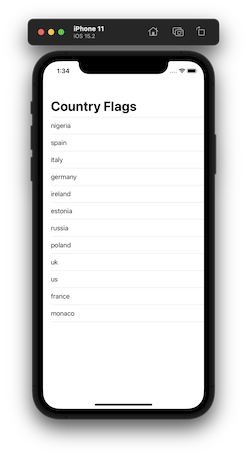
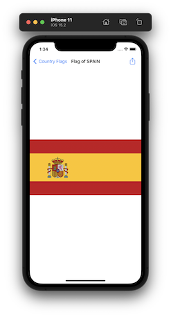
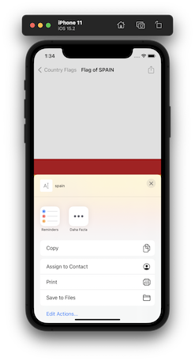

# Milestone Projects 1-3 - Country Flags

https://www.hackingwithswift.com/100/23

## Challenge

From [Hacking with Swift](https://www.hackingwithswift.com/guide/2/3/challenge):
>You have a rudimentary understanding of table views, image views, and navigation controllers, so let’s put them together: your challenge is to create an app that lists various world flags in a table view. When one of them is tapped, slide in a detail view controller that contains an image view, showing the same flag full size. On the detail view controller, add an action button that lets the user share the flag picture and country name using UIActivityViewController.
>
>To solve this challenge you’ll need to draw on skills you learned in tutorials 1, 2, and 3:
>
>1. Start with a Single View App template, then change its main ViewController class so that builds on UITableViewController instead.
>2. Load the list of available flags from the app bundle. You can type them directly into the code if you want, but it’s preferable not to.
>3. Create a new Cocoa Touch Class responsible for the detail view controller, and give it properties for its image view and the image to load.
>4. You’ll also need to adjust your storyboard to include the detail view controller, including using Auto Layout to pin its image view correctly.
>5. You will need to use UIActivityViewController to share your flag.
>
>As always, I’m going to provide some hints below, but I suggest you try to complete as much of the challenge as you can before reading them.
>
>Hints:
>
>- To load the images from disk you need to use three lines of code: let fm = FileManager.default, then let path = Bundle.main.resourcePath!, then finally let items = try! fm.contentsOfDirectory(atPath: path).
>- Those lines end up giving you an array of all items in your app’s bundle, but you only want the pictures, so you’ll need to use something like the hasSuffix() method.
>- Once you have made ViewController build on UITableViewController, you’ll need to override its numberOfRowsInSection and cellForRowAt methods.
>- You’ll need to assign a cell prototype identifier in Interface Builder, such as “Country”. You can then dequeue cells of that type using tableView.dequeueReusableCell(withIdentifier: "Country", for: indexPath).
>- The didSelectItemAt method is responsible for taking some action when the user taps a row.
>- Make sure your detail view controller has a property for the image name to load, as well as the UIImageView to load it into. The former should be modified from ViewController inside didSelectItemAt; the latter should be modified in the viewDidLoad() method of your detail view controller.
>
>Bonus tip: try setting the imageView property of the table view cell. Yes, they have one. And yes, it automatically places an image right there in the table view cell – it makes a great preview for every country.

## Screenshots

