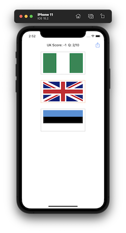
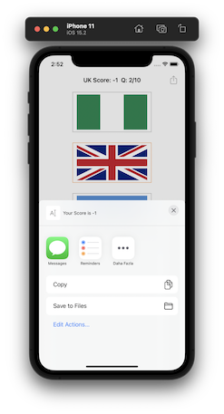

# Project 3 - Challenge 3

https://www.hackingwithswift.com/100/22

Includes solutions to the [challenges](https://www.hackingwithswift.com/read/3/3/wrap-up).

## Topics

UIBarButtonItem and UIActivityViewController

## Challenge

From [Hacking with Swift](https://www.hackingwithswift.com/read/3/3/wrap-up):
>1. Go back to project 2 and add a bar button item that shows their score when tapped.

## Screenshots

