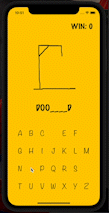

# Milestone Projects 7-9 - Hangman

https://www.hackingwithswift.com/100/41

Words list thanks to [Wiktionary](https://en.wiktionary.org/)

Bonus:
- App icon
- Support for 2 languages

## Challenge

From [Hacking with Swift](https://www.hackingwithswift.com/guide/4/3/challenge):
>This is the first challenge that involves you creating a game. You’ll still be using UIKit, though, so it’s a good chance to practice your app skills too.
>
>The challenge is this: make a hangman game using UIKit. As a reminder, this means choosing a random word from a list of possibilities, but presenting it to the user as a series of underscores. So, if your word was “RHYTHM” the user would see “??????”.
>
>The user can then guess letters one at a time: if they guess a letter that it’s in the word, e.g. H, it gets revealed to make “?H??H?”; if they guess an incorrect letter, they inch closer to death. If they seven incorrect answers they lose, but if they manage to spell the full word before that they win.
>
>That’s the game: can you make it? Don’t underestimate this one: it’s called a challenge for a reason – it’s supposed to stretch you!
>
>The main complexity you’ll come across is that Swift has a special data type for individual letters, called Character. It’s easy to create strings from characters and vice versa, but you do need to know how it’s done.
>
>First, the individual letters of a string are accessible simply by treating the string like an array – it’s a bit like an array of Character objects that you can loop over, or read its count property, just like regular arrays.
>
>When you write for letter in word, the letter constant will be of type Character, so if your usedLetters array contains strings you will need to convert that letter into a string, like this:
>
>```swift
>let strLetter = String(letter)
>````
>
>Note: unlike regular arrays, you can’t read letters in strings just by using their integer positions – they store each letter in a complicated way that prohibits this behavior.
>
>Once you have the string form of each letter, you can use contains() to check whether it’s inside your usedLetters array.
>
>That’s enough for you to get going on this challenge by yourself. As per usual there are some hints below, but it’s always a good idea to try it yourself before reading them.
>
>- You already know how to load a list of words from disk and choose one, because that’s exactly what we did in tutorial 5.
>- You know how to prompt the user for text input, again because it was in tutorial 5. Obviously this time you should only accept single letters rather than whole words – use someString.count for that.
>- You can display the user’s current word and score using the title property of your view controller.
>- You should create a usedLetters array as well as a wrongAnswers integer.
>- When the player wins or loses, use UIAlertController to show an alert with a message.
>
>Still stuck? Here’s some example code you might find useful:
>
>```swift
>let word = "RHYTHM"
>var usedLetters = ["R", "T"]
>var promptWord = ""
>
>for letter in word.characters {
>    let strLetter = String(letter)
>
>    if usedLetters.contains(strLetter) {
>        promptWord += strLetter
>    } else {
>        promptWord += "?"
>    }
>}
>print(promptWord)
>```

## Screenshots


## Screenshots2

