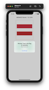
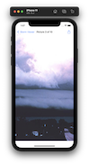
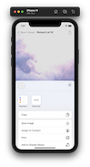
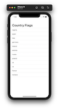
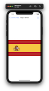
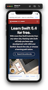
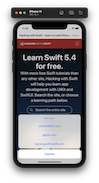
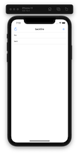
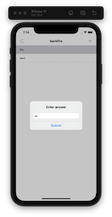

# 100-days-of-swift

Solutions to Paul Hudson's "100 days of Swift" projects and challenges.

https://www.hackingwithswift.com/100

## Completion status

Type                | Number  | Completion
:---                |  :---:  |   :---:
Projects            |  4 / 30 | 13.2%
Days                | 26 /100 |  26%
Milestone Projects  |  1 / 10 |  10%
Core Graphics redux |  0 / 1  |   0%

## Notes
- This is 100 days of **Swift**. For 100 days of **SwiftUI**, look [here](https://github.com/clarknt/100-days-of-swiftui). 

## Preview

*Within each project are larger versions of the screenshots.*

Projects / Topics                                                           | Screenshots
---                                                                         |---
[Project 1](01-Project1) - *Storm Viewer*  (with challenges)                                           View controllers, Storyboard, FileManager                   |                             |
[Project 2](02-Project2) - *Guess the Flag*  (with challenges)                                           UIButton, CALayer, IBAction, UIAlertController             |                             |
[Project 3](03-Project3) - *Social Media*  (with challenges)  (base: project 1)                        UIBarButtonItem, UIActivityViewController               |                             |
[Milestone projects 1-3](04-MilestoneProjects1-3) - *Country Flags*                                                                                                     |     |
[Project 4](05-Project4) - *Easy Browser*  (with challenges)                               WKWebView, Action sheets, UIToolbar, UIProgressView                     |                             |
[Project 4](06-Project5) - *Word Scramble*  (with challenges)                               Reading from disk, UIAlertController, IndexPath                        |                             |