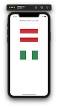
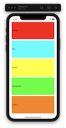
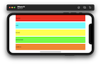
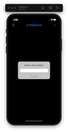
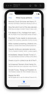

# 100-days-of-swift

Solutions to Paul Hudson's "100 days of Swift" projects and challenges.

https://www.hackingwithswift.com/100

## Completion status

Type                | Number  | Completion
:---                |  :---:  |   :---:
Projects            | 10 / 30 |  33.3%
Days                | 44 /100 |  44%
Milestone Projects  |  3 / 10 |  30%
Core Graphics redux |  0 / 1  |   0%

## Notes

## Preview

*Within each project are larger versions of the screenshots.*

Projects / Topics                                                           | Screenshots
---                                                                         |---
[Project 1](01-Project1) - *Storm Viewer*  (with challenges)                                           View controllers, Storyboard, FileManager                   |                             |
[Project 2](02-Project2) - *Guess the Flag*  (with challenges)                                           UIButton, CALayer, IBAction, UIAlertController            |                             |
[Project 3](03-Project3) - *Social Media*  (with challenges)  (base: project 1)                        UIBarButtonItem, UIActivityViewController               |                             |
[Milestone projects 1-3](04-MilestoneProjects1-3) - *Country Flags*                                                                                                    |     |
[Project 4](05-Project4) - *Easy Browser*  (with challenges)                               WKWebView, Action sheets, UIToolbar, UIProgressView                     |                             |
[Project 5](06-Project5) - *Word Scramble*  (with challenges)                               Reading from disk, UIAlertController, IndexPath                        |                             |
[Project 6](07-Project6) - *Auto Layout*  (with challenges)                                 Auto Layout, Constraints, Visual Format Language                       |                             |
[Milestone projects 4-6](08-Milestone-Projects4-6) - *Shopping List*                                                                                                   |    |
[Project 7](09-Project7) - *Whitehouse Petitions*  (with challenges)                          UITabBarController, JSON, Data, Codable                              |   |
[Project 8](10-Project8) - *7 Swifty Words*  (with challenges)                   UI in code, Text alignment, Layout Margins, UIFont                   |   |
[Project 9](11-Project9) - *Grand Central Dispatch*  (with challenges)  (base: project 7)     Grand Central Dispatch, PerformSelector                          |   |
[Milestone projects 7-9](12-Milestone-Projects7-9) - *Hangman*                                                                                                         |   |
[Project 10](13-Project10) - *Names to faces*  (with challenges)                                UICollectionView, UIImagePickerController, NSObject                |   |
[Project 11](14-Project11) - *Pachinko*   (with challenges)                                     SpriteKit, Nodes, UITouch, Physics Body, SKAction, Collisions.     |   |