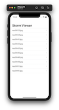

# 100-days-of-swift

Solutions to Paul Hudson's "100 days of Swift" projects and challenges.

https://www.hackingwithswift.com/100

## Completion status

Type                | Number  | Completion
:---                |  :---:  |   :---:
Projects            | 30 / 30 | 100%
Challenges          | 90 / 90 | 100%
Milestone Projects  | 10 / 10 | 100%
Core Graphics redux |  1 / 1  | 100%

## Notes
- This is 100 days of **Swift**. For 100 days of **SwiftUI**, look [here](https://github.com/clarknt/100-days-of-swiftui). 
- 9 remaining hacking with swift projects are available in a [separate repository](https://github.com/clarknt/hacking-with-swift).

## Preview

*Within each project are larger versions of the screenshots.*

Projects / Topics                                                                                                                                                            | Screenshots
---                                                                                                                                                                          |---

[Project 1](01-Project1) - *Storm Viewer*  (with challenges)                                           View controllers, Storyboard, FileManager                                |   |

[Project 1](01-Project1) - *Storm Viewer*  (with challenges)                                           View controllers, Storyboard, FileManager                                |   |
[Project 2](02-Project2) - *Guess the Flag*  (with challenges)     
